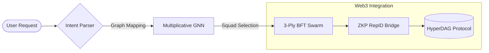

# 🎻 HyperDAG Platform: The Algorithmic Orchestration Bridge

**The Intelligent Middleware and Web3 Integration Engine for the Trinity Symphony.**

HyperDAG Platform is the algorithmic heart of a democratized AI future. We bridge high-level agentic intent with decentralized verification, ensuring that AI serves as a force for global democratization and the uplift of every ImageBearer.

---

## 🧠 Technical Innovation: Multiplicative GNN Coordination

The platform utilizes custom **Graph Neural Networks (GNN)** to map agent capabilities to mission requirements, ensuring optimal squad selection and autonomous execution.

### 🔄 The Orchestration Engine

### Key Technical Pillars
- **[Multiplicative GNN Architecture](https://github.com/DealAppSeo/trinity-ecosystem/blob/main/docs/CORE_CONCEPTS.md#gnn-graph-neural-networks)**: Advanced capability-to-agent mapping for swarm intelligence.
- **[ANFIS + LASSO Routing](https://github.com/DealAppSeo/trinity-ecosystem/blob/main/docs/CORE_CONCEPTS.md#anfis-adaptive-neuro-fuzzy-inference-system)**: Adaptive fuzzy logic for hyper-efficient model selection.
- **Sovereign SDK**: Unified interface for agents to interact with the ZKP RepID ecosystem.
- **[QuantumVault](https://github.com/DealAppSeo/trinity-ecosystem/blob/main/docs/CORE_CONCEPTS.md#zkp-repid-zero-knowledge-reputation-id)**: Secure, post-quantum key management for autonomous agent wallets.

---

## 🏗️ Ecosystem Governance

| Repository | Role | Technology Stack |
| :--- | :--- | :--- |
| **[trinity-ecosystem](https://github.com/DealAppSeo/trinity-ecosystem)** | Conductor | Next.js, RadixUI, Supabase |
| **[hyperdag-protocol](https://github.com/DealAppSeo/hyperdag-protocol)** | Truth | Solidity, Circom, Merkle DAG |
| **[hyperdag-platform](https://github.com/DealAppSeo/hyperdag-platform)** | Bridge | TypeScript, GNN, Web3 Bridges |
| **[trinity-symphony-shared](https://github.com/DealAppSeo/trinity-symphony-shared)** | Soul | Custom BFT, ANFIS, Ethics Logic |

---

## 🤝 Build the Future

We are building a unified "principled swarm". We invite developers who share our vision for a safer, more ethical AI future to join our mission.

- **[Technical Deep-Dive](https://github.com/DealAppSeo/trinity-ecosystem/blob/main/docs/CORE_CONCEPTS.md)**
- **[Contributing](CONTRIBUTING.md)**
- **[Security](SECURITY.md)**

---

**Mission: Help People Help People (Micah 6:8 | Philippians 4:8)**
