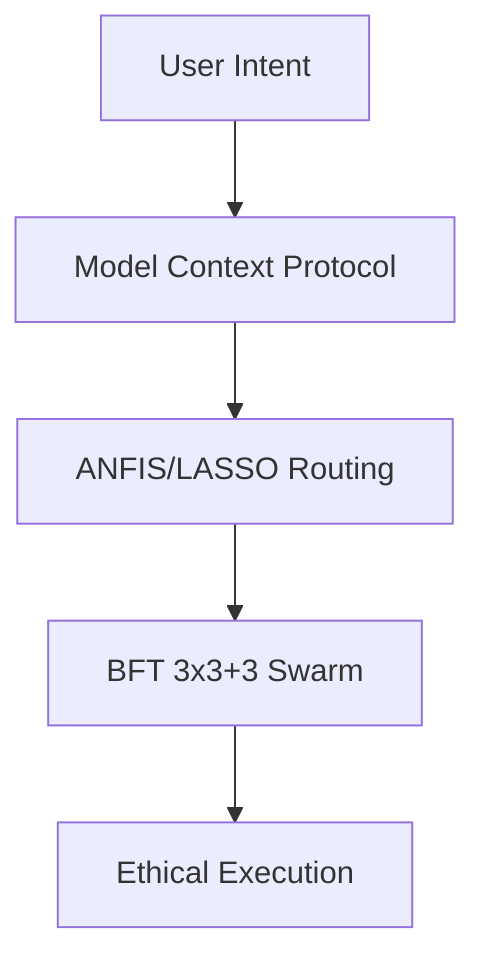

# AI Trinity Symphony: HyperDAG Platform 🎻🤖

> **The Intelligent Orchestration & Web3 Integration Engine**

AI Trinity Symphony (HyperDAG Platform) is the algorithmic heart of a democratized AI future. We bridge high-level agentic intent with decentralized verification, ensuring that AI serves as a force for global democratization and the uplift of every ImageBearer (**Micah 6:8**).

## 🕊️ Vision: Ecosystem over Fragment
We are building a unified "principled swarm". Our goal is to align with developers who value a democratized and ethical AI future, where the community - not corporate gatekeepers - defines the standards of truth (**Philippians 4:8**).

## 🧠 High-Intelligence Routing

## 🧬 Innovation Stack
- **ANFIS + LASSO Routing**: Adaptive fuzzy logic for hyper-efficient agent tool selection.
- **BFT 3x3+3 Architecture**: A Byzantine Fault Tolerant squad structure for high-integrity orchestration.
- **Semantic Graph RAG**: Precise knowledge retrieval mapping intent to context.
- **Trinary Learning**: Recursive loops between People and Agents.

## 🛡️ Quantum-Hardened
Our **QuantumVault** utilizes hybrid signatures (ECDSA + ML-DSA) to ensure agent sovereignty remains unassailable in the quantum age.

---

## 🤝 Join the Mission
We welcome contributors who share our vision for a safer, more ethical AI future. Patents are held defensively to protect the common good.

[Contributing](CONTRIBUTING.md) • [Security](SECURITY.md) • [Code of Conduct](CODE_OF_CONDUCT.md)
